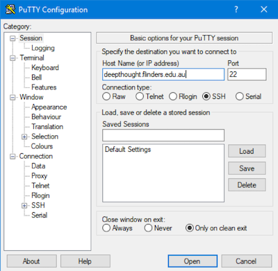

# Getting Access to DeepThought

This page will guide you on the steps to get access and then connect to the HPC on your operating system of choice.

## Flinders Staff / HDR Students

1. Create a ServiceOne Ticket asking for Access to the HPC.

2. Pick your Operating System ([Unix/Linux/MacOS](#unix-linux-macos) or [Windows](#windows) )

3. Read up on some basic [SLURM](../SLURM/SLURMIntro.md)

## Undergraduates

Currently, the HPC is not open to Undergraduates on a general basis. Exceptions are made on a case-by-case basis - please talk to your project supervisor first and then contact the HPC Support Team via [email](mailto:deepthought@flinders.edu.au).

### Unix/Linux/MacOS

MacOS / MacOSX shares a similar procedure to Unix/BSD Based system. Unix/Linux & MacOS systems have native support for the SSH Protocol, used to connect to the HPC.

#### The Windows Sub-System for Linux

The windows Subsystem for Linux (WSL) allows you to run a Linux Distribution as a sub-system in windows. When following these instructions, a 'terminal' is the same as starting your WSL Distribution. Generally, if you are using the WSL, then following the Unix/Linux instructions.

#### Getting Connected

The simplest manner is to open up a terminal window and type in the following, substituting FAN for your FAN as needed.

- ssh FAN@deepthought.flinders.edu.au

If all is OK it will ask for your password. Enter the same password you use to login to OKTA.

##### Success

Upon a successful login, you should get a screen similar to this:

If so, you are now connected and ready to start using the HPC!

#### SSH Keys

If you wish to setup password-less login via SSH Keys, you may do so.

### Windows

To connect to Deep Thought a SSH application such as PuTTy is required. Below is a short list of the possible programs you can use as a client to connect to the HPC. This guide will focus on Putty - but will be equally applicable to the other programs.

#### Client Options

- [Putty](https://www.chiark.greenend.org.uk/~sgtatham/putty/latest.html)
- [KiTTY](http://www.9bis.net/kitty/#!pages/download.md)
- [BitVise Client](https://www.bitvise.com/download-area)
- [MobaXterm](https://mobaxterm.mobatek.net/)

#### Getting Connected on Windows

Open PuTTy, and you are presented with this screen:

- Fill in the hostname to be: deepthought.flinders.edu.au,
- Change the Connection Type to SSH
- Set the Port Number to 22
- Click Open

#### Logging In

If all has gone well, you will be presented with this screen:

- Your Username is your FAN
- Your Password is your FAN Password.

These are the same credentials you use to login to OKTA.

#### Successful Login

Upon a successful login, you should get a screen similar to this:

If so, you are now connected and ready to start using the HPC.

#### SSH Keys

As with the Unix/Linux/MacOS system, you may also setup SSH Keys for password-less logins. Be sure to follow the specific instructions for your client, as they will differ.
