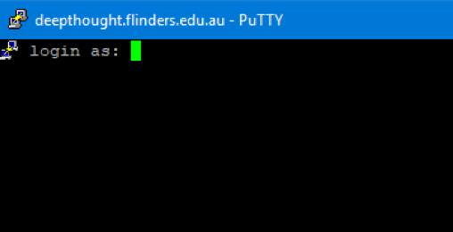

# Windows Access

To connect to Deep Thought a SSH application such as PuTTy is required. Below is a short list of the possible programs you can use as a client to connect to the HPC. This guide will focus on Putty - but will be equally applicable to the other programs.

## The Windows Sub-System for Linux

If you are using the Windows SubSystem for Linux (WSL), then go ahead and read the [Unix/Linux](../Unix/UnixAccess.md) instructions instead.

## Client Options

- [Putty](https://www.chiark.greenend.org.uk/~sgtatham/putty/latest.html)
- [KiTTY](http://www.9bis.net/kitty/#!pages/download.md)

## Getting Connected

Open PuTTy, and you are presented with this screen:

- Fill in the hostname to be: deepthought.flinders.edu.au,
- Change the Connection Type to SSH
- Set the Port Number to 22
- Click Open

## Logging In

If all has gone well, you will be presented with this screen:

- Your Username is your FAN
- Your Password is your FAN Password.

These are the same credentials you use to login to OKTA.

## Success

Upon a successful login, you should get a screen similar to this:

If so, you are now connected and ready to start using the HPC!