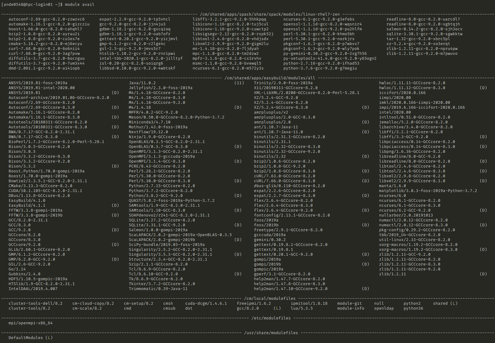

# The Module System

In mordern time, almost all HPC systems are multiuser systems and consequently, this brings many challenges. One of such challenges is effectively managing a complex and large volume of software application cohort. 

DeepThought HPC uses the [LMod](https://lmod.readthedocs.io/en/latest/) (Load MODules) system to load/unload applications in the command line. Any modules you use frequently can be loaded on login using your .bash_profile file; modules required for a job should be automated in your SLURM script.

Best way to think of Module is a singular program version + all of its associated dependencies to run correctly.

## Additional Software & Modules

Generally speaking, we can install almost all Linux/CentOS bounded software/applications on HPC, but we don't always need to go thorough the effort to install things 'globally' for everybody.

1. Are people other than just me going to use this software?
2. If yes, create an ServiceOne Ticket, and the HPC Support Team will assess the request

Otherwise, there is nothing stopping you installing the program locally for yourself! If you run into issues installing software then open an ServiceOne, or contact the HPC Support team at their [email](mailto:deepthought@flinders.edu.au).

## How Do I Install Software? 
There are multiple ways to install software on the HPC. Below is an expansion on some of the common ones. The short and sweet version is that, if you compile/install it yourself to your /home or a Virtual Environment of some kind, you are free to do whatever you want! Jus tbe mindful of space, and if its a common tool that your whole research lab will be using, consider putting in a support request so the HPC Team can make it a global module, instead of everybody having their own copy. 

The HPC support team will need to action your request if you need something big and complicated like ANSYS, GNU Octave, a new version of R or other similar large and complicated programs. 

### Python / Conda
The HPC Team allows you to install your own packages by using the inbuilt package manager tools, like Pythons 'pip', or Conda. 

As an example, you can create a Conda Virtual Environment - this is under your complete control and you may install, remove or alter it as you wish. This is also the same for Pythons 'venv', which functions in much the same way.  

The Conda Guide is located at: [Conda Guide](https://docs.conda.io/projects/conda/en/latest/user-guide/getting-started.html#managing-envs)

The Python Guide is located at: [Python Guide](https://packaging.python.org/guides/installing-using-pip-and-virtual-environments/#creating-a-virtual-environment)

### EasyBuild 
The HPC Support Team use [EasyBuild](https://easybuild.io/) to manage most of the software on the HPC (Not all, things like ANSYS and MATLAB are too complicated for such a tool). It is also open for users to self install software using the same tooling. As with all things HPC, it can get complicated - the [documentation is situated here](https://docs.easybuild.io/en/latest/). 

### Compile Your Own 
The HPC uses the FOSS Toolchain, as detailed in the [Fair Usage](../policies/fairuse.html#toolchains) Policy.  Should you wish to compile and use your own software, simply load the associated module (eg, foss-2020a) which will load up the associated tools and libraries. 

#### My Toolchain isn't Listed
Should you require a different Toolchain, like LLVM or Go and it is not listed under the `module avail` list, you can either: 

1.) Bootstrap the compiler + libraries yourself in your /home directory

2.) Contact the HPC Support Team, either via [Email](mailto:deepthought@flinders.edu.au) or [ServiceOne](https://flindersuni.service-now.com/csp)

## Module Format

As Software requirements for research can be very specific, the modules follow suit as well. Newer modules will have the following syntax:

- Program/Version-Toolchain-Version-Interpreter-Version

An example EasyBuild module is: BioPerl/1.7.2-GCCcore-8.2.0-Perl-5.28.1.

Manually installed software will always be a shorter format of:

- Program/Version

An example of a manual module is: matlab/r2020b

### Program-Version

This is program that was installed — in this case it's BioPerl, version 1.7.2

### Toolchain-Version

The Compiler Toolchain that was used to compile the program — in this case it's GCCcore, version 8.2.0.

### Interpreter-Version

Some programs have a dependence on another interpreter, like Perl or Python. In this case it's Perl, version 5.28.1. This means, it will also load the module for Perl, Version 5.28.1.

## Useful Commands

Below are some common module commands to load, unload and reset your module system.

### Available Modules

    module avail

Will get you a list of something similar to this - a list of every single available module on the HPC. You can scroll by your 'Up' and 'Down' arrows and 'q' will exit the scroll if you don't want to scroll all the way to then end. The screenshot below is not an exhaustive list of all modules, just an example!

### Loaded Modules

    module list

Will get you a list of your current modules.

### Loading Modules

There are three main ways to load a module. For most of the time, they are functionally equivalent. For more information, head on over to [LMod Loading Types](https://lmod.readthedocs.io/en/latest/010_user.html) and read up on how they differ.

- A good tip! Typing out a partial name and double-tapping 'tab' will attempt to complete the name of what you are typing. This means you don't have to worry about typing the very-long name of a module.

#### Module Load

    module load BioPerl/1.7.2-GCCcore-8.2.0-Perl-5.28.1.

There is also a nice shortcut, that you can use:

    ml BioPerl/1.7.2-GCCcore-8.2.0-Perl-5.28.1.

`ml` is just short for `module` so all the `module <option>` commands will work just fine. 

___

### An Important Note

The software must in all cases be appropriately licensed.
___

## Currently Installed Modules

The latest list is always available by running the `module avail` command on the HPC. Its broken into several segments, as there are several tools used to facilitate the installation and management of software used on the HPC. 
